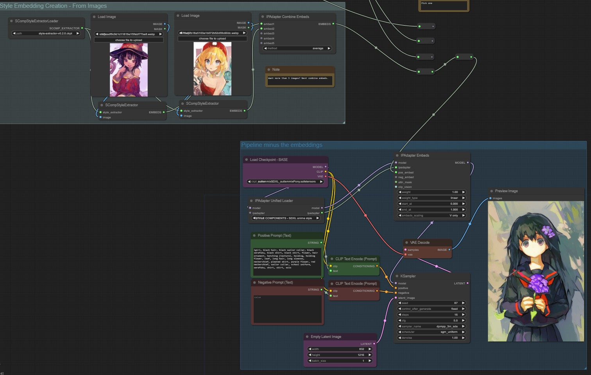

# Style Components for ComfyUI IPAdapter plus 

**Links**: [Forge extension](https://github.com/gustproof/sd-webui-forge-style-components) | [ComfyUI nodes](https://github.com/gustproof/ComfyUI_IPAdapter_plus_Style_Components) | [Civitai](https://civitai.com/models/339104)

## What is Style Components

Style Components is an IP-Adapter model conditioned on anime styles. The style embeddings can either be extracted from images or created manually. This repo currently only supports the SDXL model trained on AutismmixPony.

## Why?

Currently, the main means of style control is through artist tags. This method reasonably raises the concern of style plagiarism. By breaking down styles into interpretable components that are present in all artists, direct copying of styles can be avoided. Furthermore, new styles can be easily created by manipulating the magnitude of the style components, offering more controllability over stacking artist tags or LoRAs.

Additionally, this can be potentially useful for general purpose training, as training with style condition may weaken style leakage into concepts. This also serves as a demonstration that image models can be conditioned on arbitrary tensors other than text or images. Hopefully, more people can understand that it is not necessary to force conditions that are inherently numerical (aesthetic scores, dates, ...) into text form tags

## Usage

Clone this repo under `ComfyUI/custom_nodes`. If ComfyUI IPAdapter plus is already there, you might want to delete it first to avoid conflicts. An example workflow is provided in the file `examples/style-components-example.json`.

The [adapter model](https://huggingface.co/gustproof/sdxl-style/resolve/main/ip-adapter-style_sdxl_amix_v0.1.0_fp16.safetensors), the [style extractor](https://huggingface.co/spaces/gustproof/style-similarity/resolve/main/style-extractor-v0.2.0.ckpt) and the [component configuration](https://huggingface.co/gustproof/sdxl-style/resolve/main/pca-v0.2.1.bin) need to be downloaded and placed under `ComfyUI/models/ipadapter`.

The model is trained on AutismmixPony. Functionality on other Pony derivatives is purely coincidental and not guaranteed. The adapter is not trained with Pony tags (source_anime, score_9, ...), so these tags can be omitted when prompting.

## Technical details

A style embedding model is created by Supervised Contrastive Learning on an artists dataset. Then, a modified IP-Adapter is trained on using the same dataset with WD1.4 tags for 45k steps of batch size 1.

Due to how the model was trained, the style embeddings capture more of the local style rather than global composition. Also, no efforts were made to ensure the faces were included in the crops in training, so style embeddings may not capture well the face or eye style.
